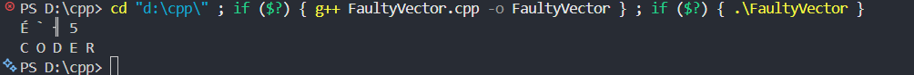

# A brief overview of the program

In C++, variables that are created from your own custom types behave like regular values. That means whenever you assign them, pass them to functions, or return them, the entire object gets copied automatically.

```cpp
#include <iostream>
using namespace std;

template <typename T>
struct MyVec
{
    T *arr;
    int size;
    int capacity;

    MyVec()
    {
        capacity = 2;
        size = 0;
        arr = new T[capacity];
    }

    ~MyVec()
    {
        delete[] arr;
    }

    void push_back(const T &element)
    {
        if (size >= capacity)
        {
            capacity *= 2;
            T *newArr = new T[capacity];

            for (int i = 0; i < size; i++)
                newArr[i] = arr[i];

            delete[] arr;
            arr = newArr;
        }

        arr[size++] = element;
    }

    void print() const
    {
        for (int i = 0; i < size; i++)
            cout << arr[i] << " ";
        cout << endl;
    }
};

int main()
{
    MyVec<char> word;

    word.push_back('C');
    word.push_back('O');
    word.push_back('D');
    word.push_back('E');

    MyVec<char> copiedWord = word;

    copiedWord.push_back('R');

    word.print();
    copiedWord.print();
}
```

## The main function

It is kept same in both the files.

```cpp
int main()
{
    MyVec<char> word;

    word.push_back('C');
    word.push_back('O');
    word.push_back('D');
    word.push_back('E');

    MyVec<char> copiedWord = word;

    copiedWord.push_back('R');

    word.print();
    copiedWord.print();
}
```

**Output:**


Did you notice the garbage value for the `MyVec<char> word` ? It occurs because there is no user defined copy constructor or any overloaded copy assignment operator. The code below performs a copy whose properties share the same references (point to the same underlying values) as those of the source object `word`.

```cpp
MyVec<char> copiedWord = word;
```

_What actually happens:_

1. `copiedWord` checks capacity.
2. Capacity is full.
3. It reallocates.
4. Deletes old memory.
5. Points to new memory.

But `word.arr` is still pointing to the **deleted memory**, hence it prints the garbage value and `copiedWord.arr` is storing the string `"coder"`, so it gets printed later.

To prevent this default behaviour, **The rule of three is implemented**
